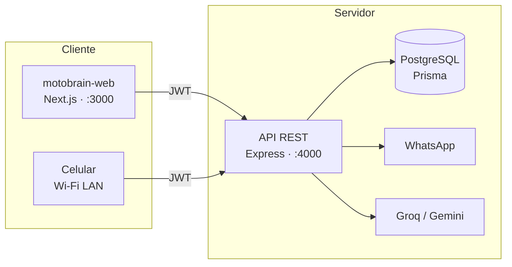

<div align="center">

# MotoBrain AI

**El sistema operativo de tu taller de motos** — inventario, servicios, IA, portal del cliente y WhatsApp.

<br />


<br />

[Inicio rápido](#-inicio-rápido) · [Funcionalidades](#-funcionalidades) · [Celular](#-celular-misma-wi‑fi) · [Variables](#-variables-de-entorno) · [API](#-api)

</div>

---

## Índice

- [Vista general](#vista-general)
- [Inicio rápido](#-inicio-rápido)
- [Funcionalidades](#-funcionalidades)
- [Arquitectura](#-arquitectura)
- [Celular (misma Wi‑Fi)](#-celular-misma-wi‑fi)
- [Variables de entorno](#-variables-de-entorno)
- [API](#-api)
- [Scripts](#-scripts)
- [Estructura](#-estructura-del-proyecto)
- [Supabase · WhatsApp · Producción](#-supabase-windows)
- [Notas](#-notas)

---

## Vista general

MotoBrain centraliza la operación diaria de talleres de motos en **Colombia**: repuestos en COP, órdenes de servicio, diagnóstico asistido por IA y un **portal** donde el cliente consulta su moto, habla con la IA y agenda citas.

| App | Carpeta | Stack | Puerto |
|:---:|:--------|:------|:------:|
| **API** | `/` | Express 5 · TypeScript · Prisma | `4000` |
| **Web** | `motobrain-web/` | Next.js 14 · Tailwind · shadcn/ui | `3000` |

> Base de la API: **`/api/v1`** · Multi-tenant por **taller** (`workshop`)

---

## Inicio rápido

### Requisitos

| | |
|---|---|
| **Node.js** | 18+ (recomendado 20 LTS) |
| **PostgreSQL** | Local o [Supabase](https://supabase.com) |
| **Opcional** | `GROQ_API_KEY` / `GEMINI_API_KEY` (IA) · Supabase Storage (fotos) |

### Instalación

```bash
git clone <tu-repo>
cd proyecto-propiedades

npm install
cd motobrain-web && npm install && cd ..
```

### Base de datos y seed

```bash
cp .env.example .env
# Edita DATABASE_URL, DIRECT_URL, JWT_SECRET, ADMIN_EMAIL, ADMIN_PASSWORD

npm run prisma:generate
npm run prisma:migrate
npm run prisma:seed
```

### Levantar en local (2 terminales)

<table>
<tr>
<th>Terminal 1 — API</th>
<th>Terminal 2 — Web</th>
</tr>
<tr>
<td>

```bash
# raíz del repo
npm run dev
```

</td>
<td>

```bash
cd motobrain-web
cp .env.local.example .env.local
npm run dev
```

</td>
</tr>
</table>

**Comprobar API**

```http
GET http://localhost:4000/api/v1/health
```

**Abrir panel** → [http://localhost:3000](http://localhost:3000)  
Login con `ADMIN_EMAIL` / `ADMIN_PASSWORD` del `.env`

---

## Funcionalidades

### Panel del taller

> **URL:** `http://localhost:3000` · Login: **Soy del taller**

| | Módulo | Ruta |
|:---:|:-------|:-----|
| 📊 | Dashboard | `/` |
| 📦 | Inventario | `/inventario` |
| 👥 | Clientes | `/clientes` |
| 🔧 | Servicios | `/servicios` |
| 🧠 | Diagnóstico IA | `/diagnostico` |
| 💬 | Consultas (portal) | `/consultas` |
| 📅 | Citas (portal) | `/citas` |
| 📈 | Analítica | `/analitica` |
| ⚙️ | Configuración | `/configuracion` |

**Roles:** `owner` · `mechanic` · `seller` — datos aislados por taller.

<details>
<summary><strong>Qué hace cada módulo</strong></summary>

| Módulo | Descripción |
|--------|-------------|
| **Inventario** | SKU, stock, precios COP, compatibilidad por moto, alertas de stock bajo |
| **Clientes** | Fichas, motos, historial, habilitar acceso al portal |
| **Servicios** | Órdenes de trabajo, repuestos, mano de obra, cierre |
| **Diagnóstico** | Síntomas → fallas, urgencia y repuestos sugeridos (Groq / Gemini) |
| **Consultas** | Preguntas del cliente; responder con precio + notificación |
| **Citas** | Solicitudes de revisión; confirmar fecha y avisar por WhatsApp |
| **Analítica** | KPIs, ingresos, export Excel *(solo owner)* |

</details>

### Portal del cliente

> **URL:** `http://localhost:3000/portal` · Login: **Soy cliente** en `/login?tab=cliente`

| Característica | Detalle |
|----------------|---------|
| Mis motos | Estado en taller y datos de la moto |
| Servicios | Activos e historial con costos |
| Hablar con la IA | Chat con respuestas automáticas o derivación al mecánico |
| Agendar revisión | Cita pendiente hasta que el taller confirme |
| Notificaciones | Aviso cuando el taller responde una consulta |
| Acceso | Teléfono + contraseña u OTP |

### Integraciones

| Servicio | Uso |
|----------|-----|
| **WhatsApp** | Recordatorios, respuestas a consultas, citas confirmadas *(opt-in)* |
| **Catálogo** | Precios de referencia para la IA *(API `/catalog`)* |
| **Recibos** | Enlace público `/recibo/[serviceId]` |

---

## Arquitectura



**Backend (capas):** dominio → casos de uso → infraestructura → interfaz  

**Frontend:** App Router · Zustand · TanStack Query · React Hook Form + Zod · Recharts · Sonner

---

## Celular (misma Wi‑Fi)

El celular **no** puede usar `localhost`. Usa la **IPv4 de tu PC** en la red local.

```bash
ipconfig
# → Dirección IPv4  (ej. 192.168.1.10)
```

**1.** En `motobrain-web/.env.local`:

```env
NEXT_PUBLIC_API_URL=http://192.168.1.10:4000/api/v1
```

**2.** Arrancar:

```bash
# Terminal 1 — raíz
npm run dev

# Terminal 2 — front en la red
cd motobrain-web
npm run dev:lan
```

**3.** En el celular (misma Wi‑Fi):

| Acceso | URL |
|--------|-----|
| Taller | `http://192.168.1.10:3000` |
| Portal | `http://192.168.1.10:3000/portal` |
| Login | `http://192.168.1.10:3000/login` |

> Si cambia la IP de la PC, actualiza `NEXT_PUBLIC_API_URL` y reinicia el front.  
> En PC puedes seguir usando `localhost:3000` (la API en PC sigue yendo a `localhost:4000`).

---

## Variables de entorno

<details>
<summary><strong>API — <code>.env</code> (raíz)</strong></summary>

| Variable | Descripción |
|----------|-------------|
| `DATABASE_URL` | Postgres runtime (Supabase pooler `:6543`) |
| `DIRECT_URL` | Migraciones (session pooler `:5432`) |
| `JWT_SECRET` | Firma JWT |
| `PORT` | Puerto API (default `4000`) |
| `ADMIN_EMAIL` / `ADMIN_PASSWORD` | Usuario del seed |
| `GROQ_API_KEY` / `GEMINI_API_KEY` | Diagnóstico y chat portal |
| `SUPABASE_URL` / `SUPABASE_SERVICE_KEY` | Fotos en Storage |
| `APP_URL` | URL pública del front (opcional) |

</details>

<details>
<summary><strong>Web — <code>motobrain-web/.env.local</code></strong></summary>

| Variable | PC | Celular |
|----------|-----|---------|
| `NEXT_PUBLIC_API_URL` | `http://localhost:4000/api/v1` | `http://<IP-PC>:4000/api/v1` |

</details>

---

## API

| Grupo | Ruta | Descripción |
|-------|------|-------------|
| Auth | `/auth` | Login del taller |
| Inventario | `/inventory` | Productos y stock |
| Clientes | `/customers` | CRM |
| Motos | `/motorcycles` | Vehículos |
| Servicios | `/services` | Órdenes de trabajo |
| Diagnóstico | `/diagnosis` | Sesiones IA |
| Analítica | `/analytics` | KPIs y export |
| Consultas | `/consultations` | Bandeja taller |
| Citas | `/appointments` | Bandeja citas |
| Portal | `/portal` | Cliente final |
| WhatsApp | `/whatsapp` | Estado / reinicio |
| Catálogo | `/catalog` | Referencia IA |

`GET /api/v1/health` — health check

---

## Scripts

<details>
<summary><strong>API (raíz)</strong></summary>

| Comando | Acción |
|---------|--------|
| `npm run dev` | Desarrollo con recarga |
| `npm run build` | Build + Prisma generate |
| `npm start` | Producción |
| `npm run prisma:migrate` | Migraciones (dev) |
| `npm run prisma:deploy` | Migraciones (prod) |
| `npm run prisma:seed` | Taller + admin |
| `npm run prisma:studio` | Explorador BD |
| `npm run check:env` | Validar URLs Supabase |

</details>

<details>
<summary><strong>Frontend (<code>motobrain-web/</code>)</strong></summary>

| Comando | Acción |
|---------|--------|
| `npm run dev` | `localhost:3000` |
| `npm run dev:lan` | Accesible en la red (`0.0.0.0`) |
| `npm run build` | Build producción |
| `npm start` | Servir build |
| `npm run lint` | ESLint |

</details>

---

## Estructura del proyecto

```
proyecto-propiedades/
├── prisma/              # Esquema y migraciones
├── src/
│   ├── domain/          # Entidades y reglas
│   ├── application/     # Casos de uso
│   ├── infrastructure/  # Prisma · JWT · IA · WhatsApp
│   └── interface/       # Rutas y controladores
├── motobrain-web/
│   └── src/
│       ├── app/         # Dashboard · portal · auth
│       ├── components/
│       ├── hooks/
│       └── lib/
├── .env.example
└── README.md
```

---

## Supabase (Windows)

| Uso | URL |
|-----|-----|
| **Runtime** | Pooler puerto **6543** + `?pgbouncer=true` |
| **Migraciones** | Session pooler puerto **5432** |

Evita depender solo de `db.*.supabase.co` si falla por IPv6.

---

## WhatsApp

1. Arranca la API → el cliente WA se inicia solo.
2. Estado: `GET /api/v1/whatsapp/status` (JWT taller).
3. Escanea el QR en **Configuración** o en la consola.
4. Plantillas: `consultation_answered`, `appointment_confirmed`, recordatorios.

> La carpeta `.wwebjs_auth/` es sesión local — **no la subas a git**.

### No usar Vercel para el bot

`whatsapp-web.js` abre Chrome con Puppeteer y mantiene la sesión en disco. **En Vercel el QR puede verse pero no vincula**: cada petición es una función efímera, sin Chrome estable ni carpeta persistente.

| Componente | Dónde desplegar |
|------------|-----------------|
| **motobrain-web** (panel) | Vercel ✅ |
| **API + WhatsApp** | Local, Railway, Render, Fly.io, VPS ✅ |
| **API + WhatsApp** | Vercel ❌ |

En Vercel deja `ENABLE_WHATSAPP` sin definir o en `false`. En Railway/Render: `ENABLE_WHATSAPP=true`, `npm run build && npm start`, y en el front `NEXT_PUBLIC_API_URL=https://tu-api.railway.app/api/v1`.

### VPS (recomendado si ya tienes servidor)

Guía paso a paso: **[docs/DEPLOY-VPS.md](docs/DEPLOY-VPS.md)** · script inicial: `bash scripts/vps-setup.sh`

| Dónde | Qué |
|-------|-----|
| VPS Ubuntu | API + `ENABLE_WHATSAPP=true` + PM2 |
| Vercel | Solo `motobrain-web` → `NEXT_PUBLIC_API_URL=https://api.tudominio.com/api/v1` |

---

## Producción

1. **API + WhatsApp** → VPS (o Railway) · `npm run build` · `pm2 start ecosystem.config.cjs` · `prisma migrate deploy`
2. **Web** → Vercel · `NEXT_PUBLIC_API_URL=https://api.tudominio.com/api/v1` (**HTTPS**)
3. No commitees `.env` ni `.env.local`

---

## Notas

- `*.legacy.js` = proyecto anterior; la API activa es `src/index.ts`.
- Primer **owner** → `npm run prisma:seed`.
- Portal del cliente → habilitar desde **Clientes** en el panel del taller.

---

<div align="center">

**MotoBrain AI** · Hecho para talleres en Colombia

<br />

Licencia **ISC** — ver `package.json`

</div>
